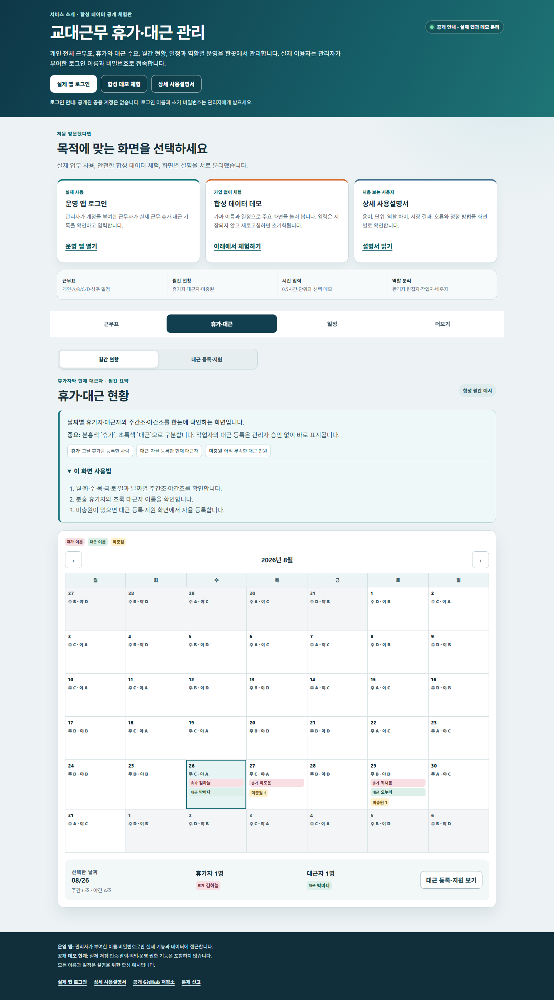
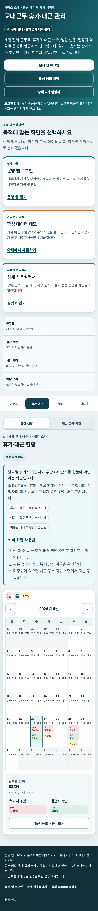

# 교대근무 휴가·대근 공개 소개·데모

운영 앱 접속, 합성 데이터 체험과 상세 사용법을 한곳에서 안내하는 공개 소개 저장소입니다. 실제 계정·회사 데이터·Supabase·운영 API는 이 저장소와 데모에 포함하지 않습니다.

- 실제 운영 앱: <https://shift-leave-pwa-operational.vercel.app>
- 공개 데모: <https://fullmetalsonic.github.io/shift-leave-pwa-demo/>
- 상세 사용설명서: <https://fullmetalsonic.github.io/shift-leave-pwa-demo/guide.html>
- 문제 신고: <https://github.com/fullmetalsonic/shift-leave-pwa-demo/issues>
- V1.2.0 Release: <https://github.com/fullmetalsonic/shift-leave-pwa-demo/releases/tag/demo-v1.2.0>

## 실제 데모 화면

### 데스크톱



### 모바일



## 공개 범위

- 실제 운영 앱의 공개 로그인 화면 주소와 관리자 지정 이름·비밀번호 로그인 방법
- `근무표` 안에서 전환하는 개인·전체 근무표
- 월간 달력의 날짜별 주간조·야간조와 휴가자·현재 대근자 이름
- 휴가와 자동 대근 수요의 관계
- 관리자 승인 없이 이루어지는 대근 자율 등록과 미충원 표시 예시
- 일정·공지와 관리자/편집자/작업자/배우자 역할 설명
- 화면 목적, 용어, 입력 단위·예시, 저장 결과, 오류와 복구 방법
- 1일·반차·반반차와 0.5시간 단위 시간휴가, 근무변경 실제 시간, 등록별 선택 메모 예시
- 데스크톱·모바일 합성 데이터 화면 캡처

## 포함하지 않는 항목

- 운영 저장소의 Git 이력과 소스 전체
- Supabase 프로젝트 주소, 테이블, RLS, RPC, migration, Edge Function
- 운영 계정, 전화번호, 비밀번호, API 키와 환경파일
- 실제 근무자·휴가·대근·공지·감사 로그와 백업 파일
- 회사 내부 경로, 운영 체크리스트, 장애·복구 기록과 배포 식별자
- 실제 로그인 이름·비밀번호·사용자 목록과 관리자 실행 기능

운영 앱 주소는 서비스 접속을 위해 공개하지만, 운영 저장소·백엔드 구조·계정 정보와 회사 데이터는 계속 비공개로 유지합니다.

상세 공개 기준은 [`docs/DEMO_SCOPE.md`](docs/DEMO_SCOPE.md), 사용법은 [`docs/USER_GUIDE.md`](docs/USER_GUIDE.md), 공개 전 검증은 [`docs/PUBLICATION_REVIEW.md`](docs/PUBLICATION_REVIEW.md)를 확인하세요.

## 로컬 실행과 검증

```powershell
pnpm install --frozen-lockfile
pnpm dev
pnpm test
pnpm build
pnpm audit --prod --audit-level high
```

브라우저 시험은 데스크톱과 Pixel 7 크기에서 주요 화면, 상호작용, 가로 넘침, 접근성 위반과 외부 네트워크 요청을 검사합니다.

## 데이터와 저장 한계

- 모든 이름과 기록은 합성 예시입니다.
- 버튼은 화면 상태만 잠시 바꾸며 서버에 저장하지 않습니다.
- 새로고침하면 최초 데모 상태로 돌아갑니다.
- 이 데모는 운영 배치, 급여, 법정 근로시간 또는 인사 결정의 근거가 아닙니다.

## 라이선스

현재 별도 오픈소스 라이선스를 부여하지 않았습니다. 공개 열람과 데모 링크 공유는 가능하지만, 코드 재사용·재배포 권한을 뜻하지 않습니다.
